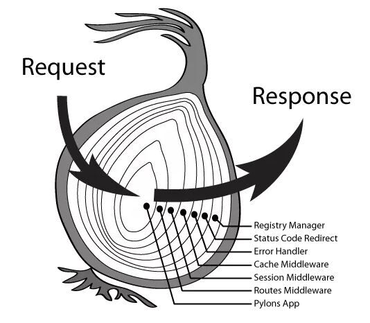

# 体验 Koa 的 “洋葱模型” 中间件系统

Koa 的中间件其实就是一个函数，通过使用 `app.use(middleware)` 方法来将中间件注册到应用中，Koa 调用中间件时，会传入两个参数 `ctx` 和 `next`，前者是请求的上下文变量，后者是一个用于执行下游中间件的函数。比如：

```javascript
const app = new Koa();
app.use(async (ctx, next) => {
    // ...
});
```

中间件按照注册的先后顺序排列，当一个 HTTP 请求进来时，会执行第一个注册的中间件，每个中间件在执行时必须手动调用 `next()` 方法来运行下一个中间件，否则下游的所有中间件将不会被执行。例如（[`./index.js`](./index.js)）：

[//]: # ()

[//]: # ()

```javascript
const app = new Koa();
app.use(async (ctx, next) => {
    console.log("--> 1");
    next();
    console.log("<-- 1");
});
app.use(async (ctx, next) => {
    console.log("--> 2");
    next();
    console.log("<-- 2");
});
app.use(async (ctx, next) => {
    console.log("--> 3");
    console.log("<-- 3");
});
app.use(async (ctx, next) => {
    console.log("--> 4");
    console.log("<-- 4");
});
```

执行上述代码，当一个 HTTP 请求进来后，控制台将输出：

```
--> 1
--> 2
--> 3
<-- 3
<-- 2
<-- 1
```

我们还可以看出，多个中间件的执行，呈现出 “先进后出” 的顺序，这通常被称之为 “洋葱模型”，如下图所示：


